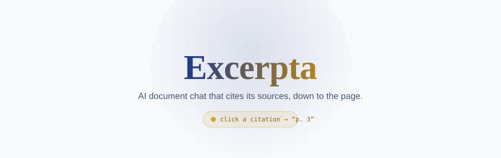
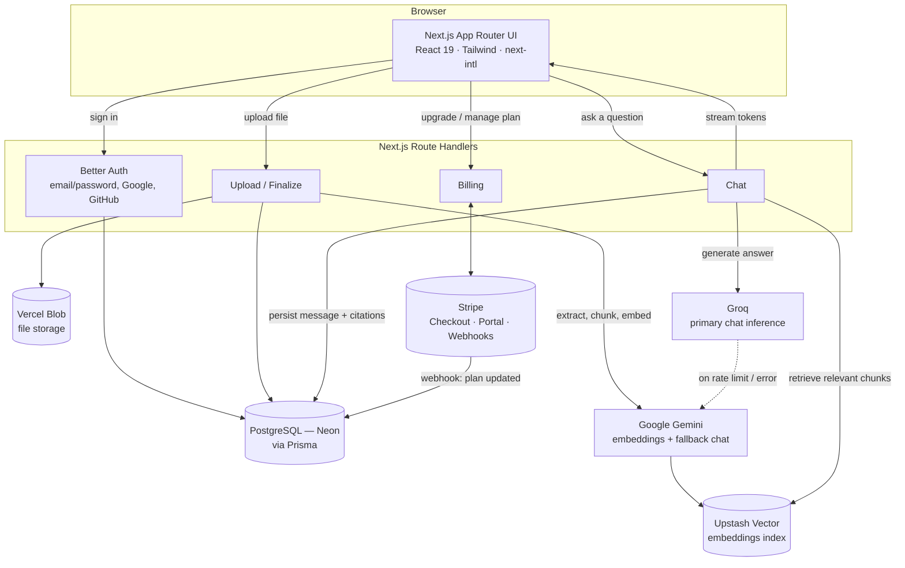

<div align="center">

<picture>
  <source media="(prefers-color-scheme: dark)" srcset=".github/readme/banner-dark.svg">
  <source media="(prefers-color-scheme: light)" srcset=".github/readme/banner-light.svg">
  
</picture>

Upload a document, ask it questions in plain language, and get answers grounded
in the text — every claim backed by a citation you can click to jump straight to
the exact page and passage it came from.

[**Live demo →**](https://excerpta-chatbot-document.vercel.app)


</div>

---

## Contents

- [What it does](#what-it-does)
- [Features](#features)
- [Architecture](#architecture)
- [Tech stack](#tech-stack)
- [Getting started](#getting-started)
- [Project structure](#project-structure)

## What it does

Most AI assistants answer confidently whether or not they're right. Excerpta is
built around a different idea: an answer is only useful if you can verify it.

1. **Upload** a PDF, Word document, spreadsheet, or source code file.
2. **Ask** a question about it, the same way you'd ask a colleague who'd just
   read it.
3. **Verify** — every answer ends with a citation tag (`p. 3`). Click it and the
   document viewer scrolls straight to that passage and highlights it in gold.
   If a claim has no citation backing it, that's a visible signal to double-check
   it, not a hidden gap.

## Features

**Documents & chat**
- Multi-format upload — PDF, DOCX, CSV, and common code file types
- Streamed, citation-grounded answers with retrieval scoped to the exact
  document (or collection) being asked about
- Click-to-scroll source highlighting, with a tolerant text-matching fallback
  for when the extracted excerpt doesn't line up character-for-character with
  the rendered page
- PDF and DOCX export of a conversation, plus revocable public read-only
  share links

**Collections**
- Group related documents into one retrieval scope — ask a question that spans
  a contract and its amendments, or a whole folder of reports, at once
- Preview a collection's documents before opening its chat workspace; add
  documents to it with a multi-select picker

**History & analytics**
- Searchable, paginated conversation history across every document and
  collection
- A dashboard of usage: documents, conversations, citations given, activity
  over time

**Accounts & billing**
- Email/password and Google/GitHub sign-in (Better Auth), with real-time
  client-side form validation (Zod)
- Free / Pro / Team plans on Stripe Checkout, self-serve upgrades and
  cancellations through the Stripe customer portal, monthly usage quotas that
  reset automatically
- Rate limiting on the chat and upload endpoints

**Everything else**
- Fully bilingual UI (English/French) via `next-intl`, including plural rules,
  server-rendered pages, and locale-aware dates
- Guided product tour for new accounts, a `⌘K` command palette, light/dark
  theme
- Terms of Service and Privacy Policy pages, and custom 404 / error pages that
  match the rest of the app instead of framework defaults

## Architecture



Groq handles chat generation by default, falling back to Gemini automatically
on a rate limit or provider error — the fallback decision happens before any
tokens reach the client, so a stream never starts on one provider and switches
mid-answer. Embeddings always go through Gemini, since Groq has no embeddings
endpoint.

## Tech stack

**Frontend**
- Next.js 16 (App Router, Turbopack, Server Components)
- TypeScript
- Tailwind CSS v3 + `tailwindcss-animate`
- `react-pdf` (PDF rendering), Phosphor Icons
- `next-intl` (i18n), `react-joyride` (onboarding), `cmdk` (command palette),
  `react-toastify` (notifications)

**Backend**
- Next.js Route Handlers
- Better Auth (Google, GitHub, email/password) + Zod-validated auth forms
- PostgreSQL (Neon) + Prisma ORM
- Vercel Blob (file storage, client-side direct upload)
- In-memory rate limiting on AI- and upload-facing endpoints

**AI**
- Groq (primary chat inference) with automatic fallback to Google Gemini
- Google Gemini (embeddings via `@google/genai`, fallback chat)
- LangChain.js `RecursiveCharacterTextSplitter` for chunking — retrieval and
  streaming themselves are hand-rolled, not routed through the Vercel AI SDK's
  `useChat`, since the backend streams plain text with a citation marker
  parsed server-side, which doesn't fit `useChat`'s structured stream protocol
- Upstash Vector (vector database)

**Billing & infra**
- Stripe (Checkout, customer portal, webhooks)
- Vercel (hosting, free tier)
- `pdf-parse`, `mammoth`, `papaparse`, `highlight.js` (file parsing)
- `pdfkit`, `docx` (export)

Every service in this stack runs on its free tier — there are no paid
dependencies anywhere in the deployment.

## Getting started

1. Clone the repository:
   ```bash
   git clone https://github.com/SaadaniMohamedAmine/excerpta-chatbot-document.git
   cd excerpta-chatbot-document
   ```
2. Install dependencies:
   ```bash
   npm install
   ```
3. Copy the environment template and fill in your own keys — Neon connection
   string, Better Auth secret + Google/GitHub OAuth credentials, Groq API key,
   Gemini API key, Upstash Vector URL/token, Vercel Blob token, and Stripe
   secret key + webhook secret + the two recurring price IDs (see the comments
   in `.env.example` for exactly what each one needs):
   ```bash
   cp .env.example .env.local
   ```
4. Push the schema to your Neon database (this project uses `prisma db push`,
   not migrations):
   ```bash
   npx prisma db push
   ```
5. Run the dev server:
   ```bash
   npm run dev
   ```
6. Open [http://localhost:3000](http://localhost:3000).

To test Stripe webhooks locally, run `stripe listen --forward-to
localhost:3000/api/webhooks/stripe` in a separate terminal.

## Project structure

```
app/            Route Handlers + pages (App Router, route groups for auth/app shells)
components/     UI, grouped by feature (dashboard, workspace, settings, auth, legal…)
lib/            AI orchestration, billing, validation, i18n config, Prisma client
messages/       en.json / fr.json — next-intl translation catalogs
prisma/         Schema and seed script
```

---

Excerpta is part of a portfolio of AI SaaS projects, built to demonstrate
production-grade full-stack AI application patterns end to end — auth, storage,
async processing, retrieval-augmented generation, billing, and internationalization
— entirely on free-tier infrastructure.
